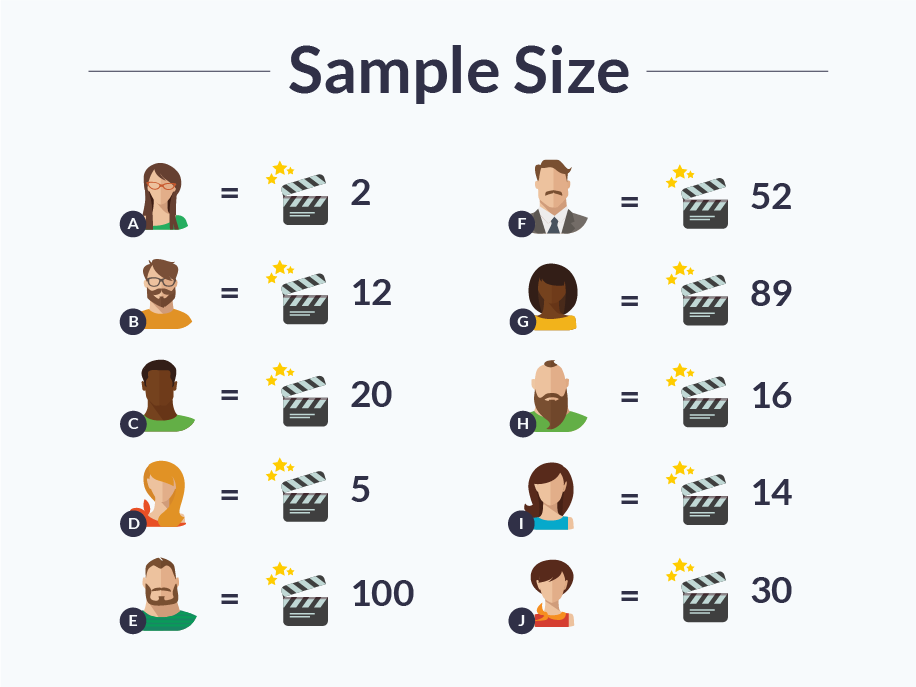
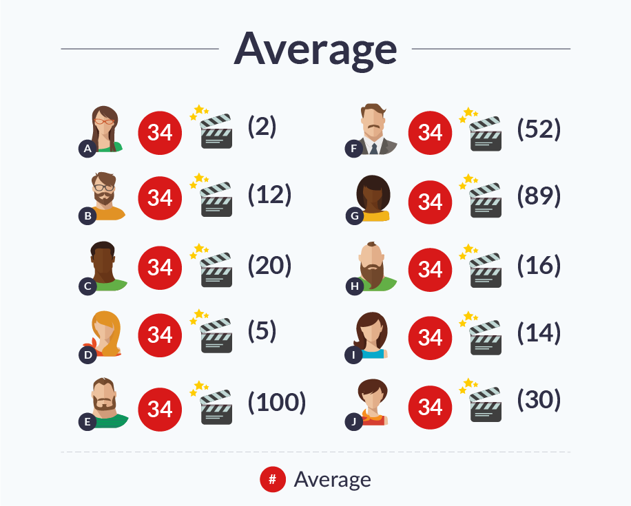

# [Understanding Your Reports: Part 3 - Key Statistics Performance Testers Need to Understand](https://www.blazemeter.com/blog/understanding-your-reports-part-3-key-statistics-performance-testers-need-understand?utm_source=BM&utm_medium=BM_blog&utm_campaign=jmeter-listeners-part3-calculate-distribution-metrics)

Welcome to part 3 of our “Understanding Your Reports” series. In part 1, we talked about what KPIs are in the context of Performance Testing. In part 2, we went over KPI correlations.

This time, we will explain basic statistics. These will help us better understand and analyze our testing reports, which we will go over next time. Today we will go over the basic terms: Sample Size, Average, Minimum Maximum, Medians, Percentiles and Standard Deviation. Let’s begin.

## Sample Size

For any statistical calculation and analysis, we first need to determine our sample size. The sample size is the number of participants or observations. In load testing, the sample size is the number of user transactions. In statistics, the sample size is usually marked as n.

Let’s look at a test case sample size of these 10 people, and the number of movies they saw in the past year:

As we can see, some people saw many movies, even almost twice a week. Others hardly saw any movies.

 
## Average

Average defines the amount each member of the sample size would have if the total number of things counted stayed the same (in this case - the number of movies), but each member of sample size had the same number of them. To calculate the average, add up the number of things counted and divide by the sample size number.

 

In this case:

2+12+20+5+100+52+89+16+14+30=340

340/10=34

The average is 34 movies per person.

## Minimum, Maximum

The minimum (min) and maximum (max) are the sample participants with the highest or lowest number of things counted.

 

In this case: member A who saw 2 movies, and member E who saw 100 movies.

## Medians

Medians are often confused with average. Unlike average where we take from the rich and give to the poor, the median examines the amount that the middle member participant has. To determine the median, line up the members from minimum to maximum, mark the member in the middle and see what his amount is.

 

In this case, the order is:

A (2 movies), D (5 movies), B (12), I (14), H (16), C (20), J (30), F (52), G (89), E (100)

 

And the medians are 16 and 20 (their average is 18).

 

We can see that the median is a better indicator of what most people have, as few people watched over 30 movies but the average is still 34.

## Percentiles

Percentiles are the value a certain percentage of the sample size has, after arranging the sample size from min to max and dividing into percents in an ascending order.

 

In this case, we already saw that the order is:

A (2 movies), D (5 movies), B (12), I (14), H (16), C (20), J (30), F (52), G (89), E (100)

 

The 70th percentile, for example, is the numbers A, D, B, I, H, C and J. This lets us view, for example, the amount of people who viewed less than 50 movies.

## Standard Deviations

The standard deviation is the measurement of the density of the cluster of the data around the sought value (mean). Low standard deviation means that points are closer to the mean. High standard deviation means the points are farther away. This parameter can help determine how reliable the data is. If the standard deviation is high, this means that results vary very much, and the analysis should be conducted accordingly.

-------------------

[Understanding Your Reports: Part 1 - What are KPIs?](https://www.blazemeter.com/blog/load-testing-kpis-part-1-what-are-kpis?utm_source=Blog&utm_medium=BM_Blog&utm_campaign=kpis-part4)

[Understanding Your Reports: Part 2 - KPI Correlations](https://www.blazemeter.com/blog/understanding-your-reports-part-2-kpi-correlations?utm_source=Blog&utm_medium=BM_Blog&utm_campaign=kpis-part1)

[Understanding Your Reports - Part 4: How to Read Your Load Testing Reports on BlazeMeter](https://www.blazemeter.com/blog/load-testing-kpis-part-1-what-are-kpis?utm_source=Blog&utm_medium=BM_Blog&utm_campaign=kpis-part4)